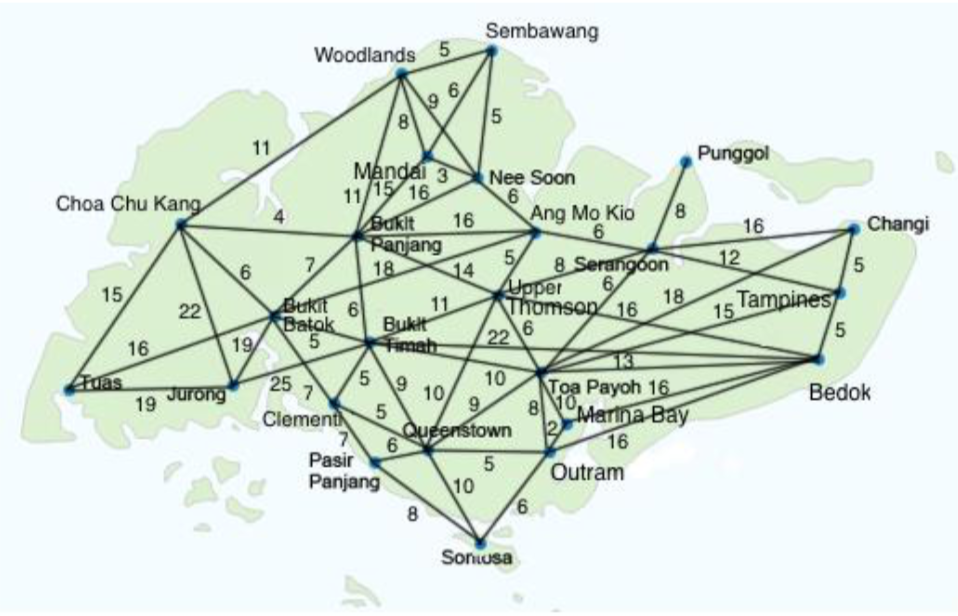

# Dijkstra (Matrix)

## Description
Map below represent the city - distance information :

## Usage
1. Change directory to `Source Code` folder : `cd Source\ Code`
2. To compile : `g++ -std=c++11 greedyAlgo.cpp readFile.cpp dijkstra.cpp Information.cpp -o greedyAlgo.exe`
3. To run : `./greedyAlgo.exe <path/filename>`
4. For mapping details, refer to `Mapping Details.xlsx`